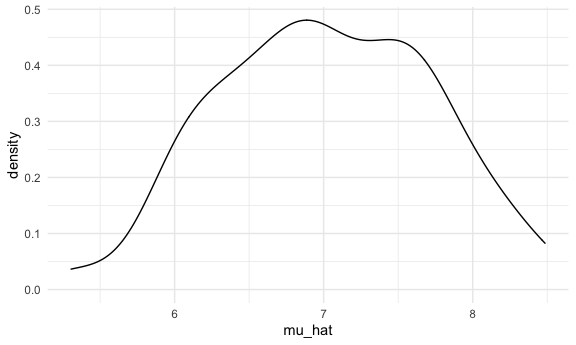
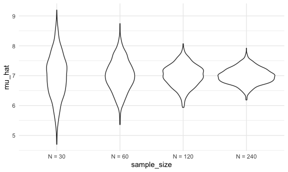
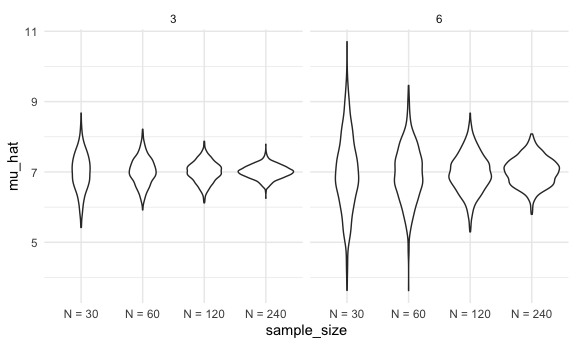

simulations
================
Zhaohua Chunyu
2022-11-03

## Simulations

Here’s our function from before.

``` r
sim_mean_sd = function(n_obs, miu = 7, sigma = 4) {
  
  x = rnorm(n = n_obs, mean = miu, sd = sigma)

  tibble(
    mu_hat = mean(x), ## estimated mean of true mean
    sigma_hat = sd(x) ## estimated sigma of true sigma
  )
  
}
```

How did we use this before?

``` r
sim_mean_sd(n_obs = 30)
```

    ## # A tibble: 1 × 2
    ##   mu_hat sigma_hat
    ##    <dbl>     <dbl>
    ## 1   6.52      3.32

How can we use this now?

Let’s start with a for loop!

``` r
## Create an output vector with 100 empty spots
output = vector("list", length = 100)

##100 hundred times I ran sim_mean_sd with number of observations equals to 30 and save the output each time 
for (i in 1:100) {
  output[[i]] = sim_mean_sd(n_obs = 30)
  
}

## Create 1 dataframe with 100 rows binding 100 dataframes
bind_rows(output)
```

    ## # A tibble: 100 × 2
    ##    mu_hat sigma_hat
    ##     <dbl>     <dbl>
    ##  1   6.49      3.24
    ##  2   8.74      4.47
    ##  3   8.49      3.37
    ##  4   7.75      3.64
    ##  5   5.98      3.87
    ##  6   6.71      4.68
    ##  7   7.60      4.07
    ##  8   6.36      3.29
    ##  9   7.51      4.87
    ## 10   7.61      4.15
    ## # … with 90 more rows

Let’s use list colomns instead.

``` r
sim_results_df = 
  expand_grid(
    sample_size = 30,
    iteration = 1:100
    ) %>% 
  mutate(
    estimate_df = map(sample_size, sim_mean_sd)
  ) %>% 
  unnest(estimate_df)
```

``` r
sim_results_df %>% 
  ggplot(aes(x = mu_hat)) +
  geom_density()
```



## What about changing the sample size?

I need a input list with lots of sample sizes.

``` r
sim_results_df = 
  expand_grid(
    sample_size = c(30, 60, 120, 240),
    iteration = 1:1000
  ) %>% 
  mutate(
    estimate_df = map(sample_size, sim_mean_sd)
  ) %>% 
  unnest(estimate_df)
```

``` r
sim_results_df %>% 
  mutate(
    sample_size = str_c("N = ", sample_size),
    sample_size = fct_inorder(sample_size)
  ) %>% 
  ggplot(aes(x = sample_size, y = mu_hat)) + 
  geom_violin()
```



``` r
sim_results_df %>% 
  mutate(
    sample_size = str_c("N = ", sample_size),
    sample_size = fct_inorder(sample_size)
  ) %>% 
  group_by(sample_size) %>% 
  summarize(
    emp_st_error = sd(mu_hat)
  )
```

    ## # A tibble: 4 × 2
    ##   sample_size emp_st_error
    ##   <fct>              <dbl>
    ## 1 N = 30             0.738
    ## 2 N = 60             0.528
    ## 3 N = 120            0.362
    ## 4 N = 240            0.262

## Let’s see two inputs…

``` r
sim_results_df = 
  expand_grid(
    sample_size = c(30, 60, 120, 240),
    true_sigma = c(6, 3),
    iteration = 1:1000
  ) %>% 
  mutate(
    estimate_df = 
      map2(.x = sample_size, .y = true_sigma, ~sim_mean_sd(n_obs = .x, sigma = .y))
  ) %>% 
  unnest(estimate_df)
```

``` r
sim_results_df %>% 
  mutate(
    sample_size = str_c("N = ", sample_size),
    sample_size = fct_inorder(sample_size)
  ) %>% 
  ggplot(aes(x = sample_size, y = mu_hat)) + 
  geom_violin() + 
  facet_grid(. ~ true_sigma)
```


